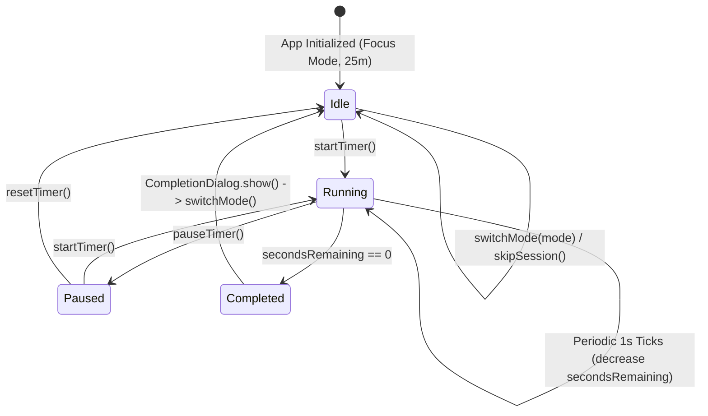

# ⏱️ PomoFlow — Premium Pomodoro Focus Timer

PomoFlow is a production-grade, highly polished, and responsive Pomodoro Focus Timer application built with **Flutter (Material 3)**. The application strictly adheres to Clean UI principles and is structured under a professional **MVVM (Model-View-ViewModel)** architectural pattern. It contains zero boilerplate, zero placeholder files, and has no external state management dependencies.

---

## 🌟 Key Product Features

- **Universal Responsiveness**: Designed using responsive constraints (centered and constrained to a maximum width of `600px`). It renders perfectly on web browsers, desktop windows, tablets, and mobile screens.
- **Ambient Glassmorphic Aesthetic**: Immerse users in a sleek dark theme background (`#1E1E2C`) utilizing dynamic radial gradients that smoothly transition colorways depending on the active mode.
- **Three Structured Timing Modes**:
  - **Focus Session**: 25 minutes | Red Accent Color (`#FF5252`)
  - **Short Break**: 5 minutes | Green Accent Color (`#4CAF50`)
  - **Long Break**: 15 minutes | Blue Accent Color (`#2196F3`)
- **Fluid Progress Rings**: A large countdown display with a high-fidelity digital clock utilizing tabular figures (monospaced glyphs) to eliminate layout jitter. The track features a smooth `TweenAnimationBuilder` progress animation.
- **Interactive Control Deck**:
  - **Primary Play/Pause Button**: Large central floating circular action button displaying smooth icon transitions.
  - **Secondary Actions**: Reset and Skip buttons styled with circular outline borders, custom tooltips, and inkwell ripples.
- **Glassmorphic Completer Dialog**: Blurred BackdropFilter overlays celebrate completed sessions and dynamically guide the user to the next logical phase.

---

## 🏗️ Architectural Design (MVVM)

PomoFlow is organized under a modular MVVM structure to separate visual layouts from state logic. This architecture ensures testability, modularity, and scalability.

```
pomodoro_focus_flutter_app/
├── .github/
│   └── workflows/
│       └── deploy.yml              # CI/CD deployment configuration
├── lib/
│   ├── main.dart                  # App setup & execution entry point
│   ├── theme/
│   │   └── app_theme.dart         # Material 3 theme properties
│   ├── models/
│   │   └── pomodoro_mode.dart     # Data structures & properties for Pomodoro modes
│   ├── viewmodels/
│   │   └── pomodoro_viewmodel.dart# Timer states, loops, operations, change notifications
│   └── views/
│       ├── pomodoro_screen.dart   # Main screen binding VM notifications
│       └── widgets/
│           ├── completion_dialog.dart # Session end blur modal
│           ├── control_buttons.dart   # Play/Pause, Reset, Skip widgets
│           ├── mode_selector.dart     # Capsule selector pills
│           └── timer_ring.dart        # Digital timer text & progress rings
```

### 🔁 Decoupled Lifecycle Flow



#### 1. Model Layer (`models/`)
- Encapsulates properties mapping to each timer mode. It defines the raw timing parameters (minutes) and accent color representations cleanly away from the controller logic.

#### 2. ViewModel Layer (`viewmodels/`)
- Governs the business rules. It starts the timer ticking loop, calculates remaining fractions (`progress`), and fires `notifyListeners()` on changes. It exposes a callback `onSessionCompleted` to notify views of completed cycles.

#### 3. View Layer (`views/` & `widgets/`)
- Composed of purely stateless visual representations (`TimerRing`, `ModeSelector`, `ControlButtons`) that accept configurations and forward actions to the ViewModel.
- Bound to the ViewModel using `ListenableBuilder` to selectively rebuild the widget hierarchy when values change.

---

## 💻 Setup & Developer Guide

### Prerequisites
- Install the **Flutter SDK** (recommended: stable channel, version 3.20 or newer).
- Configure target environments (Android Studio, Xcode, Chrome, or Windows/macOS desktop build tools).

### 1. Installation
Clone the repository and fetch dependencies:
```bash
git clone https://github.com/JAIN2309/pomoflow-timer.git
cd pomoflow-timer
flutter pub get
```

### 2. Run Local Development
Launch PomoFlow on your preferred connected simulator, browser, or desktop window:
```bash
flutter run
```
To force run in Chrome:
```bash
flutter run -d chrome
```

### 3. Run Static Code Analysis
Ensure the codebase adheres to linting standards with zero warnings or errors:
```bash
flutter analyze
```

### 4. Run Test Suite
Validate the initialization, widget renders, and play controls using the testing harness:
```bash
flutter test
```

---

## 🌐 Build & Deployment

### Manual Compilation & Deploy
1. Build the production-grade static web files containing your repo's base URL path:
   ```bash
   flutter build web --base-href "/pomoflow-timer/" --release
   ```
2. Navigate to the compiled build directory:
   ```bash
   cd build/web
   ```
3. Initialize Git locally and push the static files to the repository's `gh-pages` branch:
   ```bash
   git init
   git remote add origin https://github.com/JAIN2309/pomoflow-timer.git
   git add .
   git commit -m "deploy: update release build"
   git push -f origin master:gh-pages
   ```

### Automated CI/CD (GitHub Actions)
Pushing changes directly to the `main` branch triggers the configuration file at `.github/workflows/deploy.yml` which automatically handles compilation and hosting deployments on GitHub Pages.
